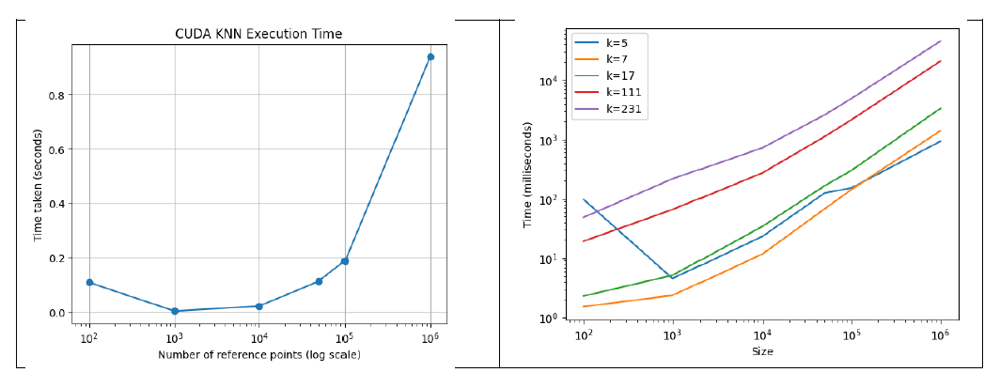

# CUDA Implementation Integrated Machine Learning Algorithms of K-Means and KNN Algorithms

## 🙇‍♂️ Project description
The project aims to implement an integrated solution using CUDA for parallel computation of two fundamental machine learning algorithms: K-Nearest Neighbors (KNN) and K-Means clustering. These algorithms are interrelated in their applications and can benefit from parallelization using CUDA, allowing for efficient processing of large datasets. 

## 🧱 Block diagram

## (1) K-Means
**Overview of Implementations and Measurements** 
K-means clustering is a popular unsupervised machine learning algorithm used for clustering data points into groups based on similarities. It aims to partition the data into K clusters where each data point belongs to the cluster with the nearest mean, serving as the cluster's centroid. We have implemented the k-nearest neighbors (KNN) algorithm using three different approaches: 
1. CPU-based implementation in Python using sklearn. 
2. CPU-based implementation in C. 
3. GPU-based implementation in Python using TensorFlow. 
4. cuML-based implementation with cuDF in Python. 
5. CUDA-based implementation.br>
6. CUDA-based implementation with streaming.br>
The objective is to compare the performance of the K-Meansalgorithm across these implementations, particularly focusing on the speedup achieved by utilizing GPU acceleration. 

**1. CPU-based implementation in Python using sklearn:** 
This implementation utilizes the pandas, numpy, and scikit-learn libraries for data manipulation, numerical operations, and machine learning algorithms, respectively. Here's a summary of the Python implementation: 
1. Data Loading and Preprocessing: The script loads datasets of different sizes from CSV files, standardizes the features using StandardScaler, and iterates over different numbers of clusters. 
2. K-means Clustering: It applies the K-means clustering algorithm using KMeans from scikit-learn, measures the time taken for clustering, and stores the results in a DataFrame. 
3. Results: The clustering results, including data size, number of clusters, and time taken for clustering. 

| Data Size | Clusters | Time (seconds) |
|-----------|----------|----------------|
| 10,000    | 10       | 0.842065       |
| 10,000    | 100      | 2.387318       |
| 10,000    | 1,000    | 41.758798      |
| 100,000   | 10       | 4.466653       |
| 100,000   | 100      | 16.375293      |
| 100,000   | 1,000    | 143.831143     |
| 1,000,000 | 10       | 10.407497      |
| 1,000,000 | 100      | 141.549031     |
| 1,000,000 | 1,000    | 1593.802099    |

**2. CPU-based implementation in C** 
The C implementation directly reads CSV data and implements the K-means algorithm from scratch without relying on external libraries. Here's an overview of the C implementation: 
1. Data Reading: It reads CSV data directly from files and dynamically allocates memory to store the data points. 
2. K-means Algorithm: The algorithm consists of two main functions: kMeansClusterAssignment and kMeansCentroidUpdate, responsible for assigning data points to clusters and updating cluster centroids iteratively. 
3. Results: After a predefined number of iterations, the total time taken for clustering is printed. 

| Data Size | Clusters | Time (seconds) |
|-----------|----------|----------------|
| 10000     | 10       | 0.059939       |
| 10000     | 100      | 0.514360       |
| 10000     | 1000     | 3.335168       |
| 100000    | 10       | 0.404125       |
| 100000    | 100      | 3.388042       |
| 100000    | 1000     | 41.548951      |
| 1000000   | 10       | 5.506077       |
| 1000000   | 100      | 44.086444      |
| 1000000   | 1000     | 415.07164      |

**3. GPU-based implementation in Python using TensorFlow** 
The TensorFlow implementation utilizes TensorFlow's computational graph and automatic differentiation capabilities to perform K-means clustering efficiently. Here's a summary of the implementation: 
1. Data Loading and Preprocessing: The script loads datasets of different sizes from CSV files using pandas, standardizes the features using StandardScaler, and converts the data into TensorFlow tensors for compatibility with TensorFlow operations. 
2. K-means Clustering Function: The kmeans function defines the K-means clustering algorithm using TensorFlow operations. It initializes centroids randomly, iteratively assigns points to the nearest centroid, and updates centroids based on the mean of the assigned points. 
3. GPU Acceleration: The implementation utilizes TensorFlow's GPU support to accelerate the computation of K-means clustering. It specifies GPU options and creates a TensorFlow session configured to use the GPU. 
4. Clustering Process: The script iterates over different dataset sizes and numbers of clusters. For each combination of dataset size and number of clusters, it measures the time taken for K-means clustering on the GPU using TensorFlow. 
5. Results: The clustering results, including data size, number of clusters, and time taken for clustering. 

| Data Size | Clusters | Time (seconds) |
|-----------|----------|----------------|
| 10000     | 10       | 0.871729       |
| 10000     | 100      | 6.014540       |
| 10000     | 1000     | 49.04130       |
| 100000    | 10       | 0.471055       |
| 100000    | 100      | 4.323267       |
| 100000    | 1000     | 51.07692       |
| 1000000   | 10       | 0.604169       |
| 1000000   | 100      | 4.198499       |
| 1000000   | 1000     | 51.03058       |

**4. cuML-based implementation with cuDF in Python:** 
The cuML implementation utilizes NVIDIA's GPU-accelerated K-means clustering algorithm to efficiently cluster large datasets on GPUs. Here's a summary of the implementation: 
1. Data Loading and Preprocessing: The script loads datasets of different sizes from CSV files using pandas, standardizes the features using StandardScaler from scikit-learn, and prepares the data for clustering. 
2. K-means Clustering with cuML: The implementation applies K-means clustering using the KMeans class from cuml.cluster. This class provides a GPU-accelerated implementation of the K-means algorithm, enabling faster clustering on NVIDIA GPUs. 
3. GPU Acceleration: cuML leverages the parallel processing capabilities of NVIDIA GPUs to accelerate the computation of K-means clustering. By offloading computation to the GPU, it achieves significant speedups compared to CPU-based implementations. 
4. Clustering Process: The script iterates over different dataset sizes and numbers of clusters, measures the time taken for K-means clustering using cuML, and stores the results in a list. 
5. Results: The clustering results, including data size, number of clusters, and time taken for clustering. 

| Data Size | Clusters | Time (seconds) |
|-----------|----------|----------------|
| 10000     | 10       | 1.278008       |
| 10000     | 100      | 0.072464       |
| 10000     | 1000     | 0.475428       |
| 100000    | 10       | 0.040021       |
| 100000    | 100      | 0.178397       |
| 100000    | 1000     | 1.900078       |
| 1000000   | 10       | 0.354767       |
| 1000000   | 100      | 1.561732       |
| 1000000   | 1000     | 14.652058      |

**5. CUDA-based implementation** 
This Implementation leverages CUDA to parallelize the K-means clustering algorithm, improving performance for large datasets by taking advantage of the GPU's parallel processing capabilities. 
Execution Flow: 
1- Reading Data: 
• The readCSVData function reads the CSV file and populates the datapoints array. 
• The number of points and dimensions are determined. 
2- Memory Allocation: 
• Allocates memory on both host and device for data points, centroids, cluster assignments, and cluster sizes. 
3- Initialization: 
• Initializes centroids randomly from the data points. 
4- K-means Iterations: 
• For each iteration: 
o The kMeansClusterAssignment kernel assigns each data point to the nearest centroid. 
o The kMeansCentroidUpdate kernel updates the centroids by averaging the assigned points. 
o The normalizeCentroids kernel normalizes the centroids. 
5- Timing: 
• CUDA events are used to record the start and stop times of the K-means iterations. 
• The total time is calculated and printed. 
6- Cleanup: 
• Frees the allocated memory on both the host and device. CUDA Kernels in Detail. 
1. Cluster Assignment Kernel: 
• Computes the distance from each point to each centroid. 
• Assigns the point to the nearest centroid. 
2. Centroid Update Kernel: 
• Uses shared memory to accumulate the sum of points for each centroid. 
• Uses atomic operations to ensure correct summation in parallel. 
3. Normalization Kernel: 
• Divides the accumulated sum by the number of points in each cluster to compute the mean. 

| Data Size  | Clusters | Time (seconds) |
|------------|----------|----------------|
| 10000      | 10       | 0.162942       |
| 10000      | 100      | 0.002410       |
| 10000      | 1000     | 0.009373       |
| 100000     | 10       | 0.001900       |
| 100000     | 100      | 0.006472       |
| 100000     | 1000     | 0.047023       |
| 1000000    | 10       | 0.010275       |
| 1000000    | 100      | 0.055242       |
| 1000000    | 1000     | 0.351849       |
| 10000000   | 10       | 0.094760       |
| 10000000   | 100      | 0.409743       |
| 10000000   | 1000     | 2.251465       |

**6. CUDA-based implementation with streaming** 
CUDA streams allow for concurrent execution of memory transfers and kernel execution. In this implementation, two streams are created to overlap computation with memory transfers The implementation of k-means using CUDA with streaming demonstrates significant performance improvements over traditional CPU implementations. By leveraging the parallel computing capabilities of GPUs and using streams to overlap computation with memory transfers, the algorithm can handle large datasets more efficiently. This implementation highlights the importance of optimizing both computation and memory access patterns in GPU programming. 

| Data Size  | Clusters | No Streaming | Streaming    |
|------------|----------|--------------|--------------|
| 10000      | 10       | 0.162942     | 0.000728     |
| 10000      | 100      | 0.002410     | 0.001503     |
| 10000      | 1000     | 0.009373     | 0.009231     |
| 100000     | 10       | 0.001900     | 0.001730     |
| 100000     | 100      | 0.006472     | 0.006322     |
| 100000     | 1000     | 0.047023     | 0.046692     |
| 1000000    | 10       | 0.010275     | 0.010131     |
| 1000000    | 100      | 0.055242     | 0.055107     |
| 1000000    | 1000     | 0.351849     | 0.352530     |
| 10000000   | 10       | 0.094760     | 0.094549     |
| 10000000   | 100      | 0.409743     | 0.380678     |
| 10000000   | 1000     | 2.251465     | 2.180443     |

**Speedup of the GPU over the CPU:** 

| Data Size  | Clusters | GPU Time | CPU Time   | Speedup    |
|------------|----------|----------|------------|------------|
| 10000      | 10       | 0.162942 | 0.059939   | 0.3678x    |
| 10000      | 100      | 0.002410 | 0.514360   | 213.42x    |
| 10000      | 1000     | 0.009373 | 3.335168   | 355.82x    |
| 100000     | 10       | 0.001900 | 0.404125   | 212.697x   |
| 100000     | 100      | 0.006472 | 3.388042   | 523.492x   |
| 100000     | 1000     | 0.047023 | 41.548951  | 883.586x   |
| 1000000    | 10       | 0.010275 | 5.506077   | 535.871x   |
| 1000000    | 100      | 0.055242 | 44.086444  | 798.06x    |
| 1000000    | 1000     | 0.351849 | 415.071644 | 1179.686x  |
| 10000000   | 10       | 0.094760 | 49.511440  | 522.493x   |
| 10000000   | 100      | 0.409743 | 428.748454 | 1046.383x  |
| 10000000   | 1000     | 2.251465 | 4156.124091| 1845.964x  |

**CPU benchmarks for kmeans:** 
Kmeans benchmarks depend on several factors: 
• Input data size (number of data points and dimensionality): 
This has a notable effect on time, as increasing either the number of data points or number of features increases the execution time. 
• Number of clusters (K): 
Increasing the numbers of clusters also increases the execution time substantially as more clusters generally require more iterations. 
• CPU architecture used, clock speed, and number of cores (whether single or multicore) 
• Libraries and implementation: 
Whether we use libraries like Scikit-learn (Python) or a code implementation of Kmeans affects performance Their GPU counterparts: 
• Input data size (number of data points and dimensionality): 
This has a notable effect on time, as increasing either the number of data points or number of features increases the execution time. 
• Number of clusters (K): 
Increasing the numbers of clusters also increases the execution time substantially as more clusters generally require more iterations. 
• GPU architecture used, and number of blocks, number of threads per block, shared memory size. 
• Libraries and implementation: 
Whether we use libraries like cuML (Python) or a code implementation of Kmeans affects performance. 

**GPU results compare to open-source peers:**

| Data Size  | Clusters | GPU Time | cuML Time  |
|------------|----------|----------|------------|
| 10000      | 10       | 0.162942 | 1.278008   |
| 10000      | 100      | 0.002410 | 0.072464   |
| 10000      | 1000     | 0.009373 | 0.475428   |
| 100000     | 10       | 0.001900 | 0.040021   |
| 100000     | 100      | 0.006472 | 0.178397   |
| 100000     | 1000     | 0.047023 | 1.900078   |
| 1000000    | 10       | 0.010275 | 0.354767   |
| 1000000    | 100      | 0.055242 | 1.561732   |
| 1000000    | 1000     | 0.351849 | 14.652058  |

**Comparison between implementations:**

## (2) KNN
**Overview of Implementations and Measurements** 
I have implemented the k-nearest neighbors (KNN) algorithm using three different approaches: 
1. CPU-based implementation in Python 
2. CUDA-based implementation 
3. cuML-based implementation with cuDF in Python 
The objective is to compare the performance of the KNN algorithm across these implementations, particularly focusing on the speedup achieved by utilizing GPU acceleration.

**1. CPU-based KNN Implementation in Python** 
The CPU implementation is straightforward and involves calculating the Euclidean distance between each query point and all reference points, sorting these distances, and selecting the nearest k neighbors. 
I measured the execution time of this implementation for different sizes of reference points and various values of k. 

**2. GPU-based KNN Implementation in Python** 
In the CUDA implementation of the K-Nearest Neighbors (KNN) algorithm, parallelism is achieved through the use of CUDA threads and blocks. Each thread in a CUDA block processes one query point. This means that if we have m query points, we will launch m threads.  
I measured the execution time of this implementation for different sizes of reference points and various values of k. 

**3. cuML-based KNN Implementation with cuML in Python** 
The cuML-based implementation uses RAPIDS AI libraries to perform KNN computations. This approach also utilizes GPU acceleration but through a higher-level API provided by cuML. 

**Spead up of GPU over CPU = CPU time/GPU time= 213.35** 
**Spead up of RAPIDS cuml over my GPU= CPU time/GPU time= 6.656** 

## Future work
1- PCA  

   

